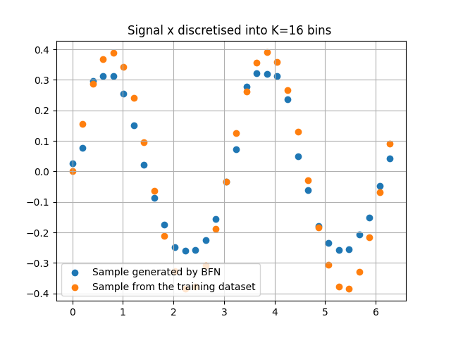

# A naive implementation of [Bayesian Flow Networks](https://arxiv.org/abs/2308.07037)

---

Algorithm 5 of the paper has been implemented [Continuous-Time Loss L∞(x) for Discretised Data]. I am looking forward to add all, but I'd be happy if you can contribute.

The model has been tested with toy data with sinousoidal shape . Here is the generated sample versus a sample from dataset.

#### Updated to use vmap for speed up the process of cdf calculation